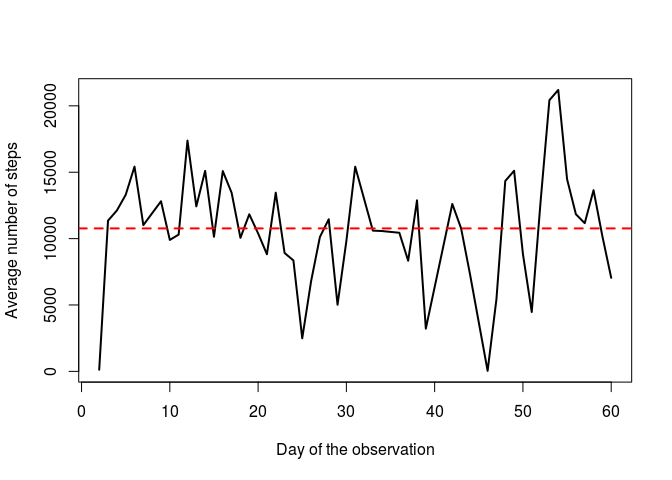
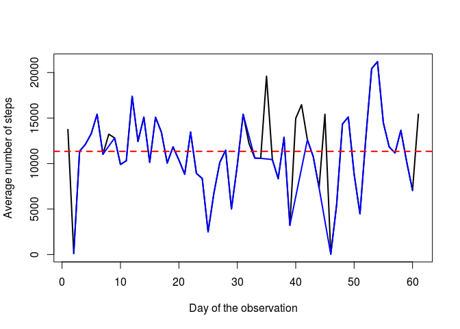
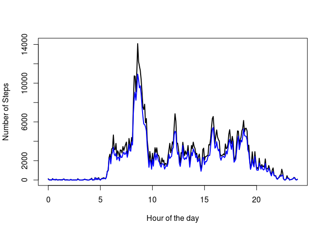

# Nike Activity
Francisco J. Falcon Chavez  
March 16, 2016  
#Data loading#
By using the Nike Fuelband, a device that can track the number of steps made in an certain interval, an individual's activities were monitored throughout the day. Data was taken from 12:00am of the 1st day of October until 11:55pm of the 30th day of November, every 5 minutes making 288 observations per day.

Assuming the current working directory is where the data is, it can be loaded with:


```r
Nike_rawData <- read.csv('activity.csv')
summary(Nike_rawData)
```

```
##      steps                date          interval     
##  Min.   :  0.00   2012-10-01:  288   Min.   :   0.0  
##  1st Qu.:  0.00   2012-10-02:  288   1st Qu.: 588.8  
##  Median :  0.00   2012-10-03:  288   Median :1177.5  
##  Mean   : 37.38   2012-10-04:  288   Mean   :1177.5  
##  3rd Qu.: 12.00   2012-10-05:  288   3rd Qu.:1766.2  
##  Max.   :806.00   2012-10-06:  288   Max.   :2355.0  
##  NA's   :2304     (Other)   :15840
```

Then, we added three columns:
1. A column that numbered each day.
2. A column with the relative time in hours.
3. A column with the day of the week.


```r
Nike_rawData$nDay <- sort(rep(1:length(names(table(as.matrix(Nike_rawData$date)))),288))
Nike_rawData$TimeHour <- rep((0:287)*5/60,length(names(table(as.matrix(Nike_rawData$date)))))
WeekDays<- c('Mon','Tue','Wed','Thu','Fri','Sat','Sun')
for (i in 1:7){
  j=0
  while (j*7+i <= length(names(table(as.matrix(Nike_rawData$date))))){
   Nike_rawData$WeekDay[Nike_rawData$nDay==j*7+i] <- WeekDays[i]
   j=j+1
  }
}
head(Nike_rawData)
```

```
##   steps       date interval nDay   TimeHour WeekDay
## 1    NA 2012-10-01        0    1 0.00000000     Mon
## 2    NA 2012-10-01        5    1 0.08333333     Mon
## 3    NA 2012-10-01       10    1 0.16666667     Mon
## 4    NA 2012-10-01       15    1 0.25000000     Mon
## 5    NA 2012-10-01       20    1 0.33333333     Mon
## 6    NA 2012-10-01       25    1 0.41666667     Mon
```

It is important to remark that all the missing values were omitted until they were replaced. #Mean and median# Mean and median was calculated for each day.


```r
MeanPerDay <- cbind(as.matrix(unique(Nike_rawData$date[!is.na(Nike_rawData$steps)])),aggregate(steps ~ nDay, data=Nike_rawData[!is.na(Nike_rawData$steps),],FUN=mean))
colnames(MeanPerDay) <- c('date','nDay','steps')
head(MeanPerDay)
```

```
##         date nDay    steps
## 1 2012-10-02    2  0.43750
## 2 2012-10-03    3 39.41667
## 3 2012-10-04    4 42.06944
## 4 2012-10-05    5 46.15972
## 5 2012-10-06    6 53.54167
## 6 2012-10-07    7 38.24653
```

```r
MedianPerDay <- cbind(as.matrix(unique(Nike_rawData$date[!is.na(Nike_rawData$steps)])),aggregate(steps ~ nDay, data=Nike_rawData[!is.na(Nike_rawData$steps),],FUN=median))
colnames(MedianPerDay) <- colnames(MeanPerDay)
head(MedianPerDay)
```

```
##         date nDay steps
## 1 2012-10-02    2     0
## 2 2012-10-03    3     0
## 3 2012-10-04    4     0
## 4 2012-10-05    5     0
## 5 2012-10-06    6     0
## 6 2012-10-07    7     0
```

#Plotting the data#

With the objective of seeing the activity of the subject, a plot with the data throughout the two months of observations was made (the dashed red line is the mean of all the data).


```r
plot(aggregate(steps ~ nDay , Nike_rawData[!is.na(Nike_rawData$steps),],FUN=sum),type='l',lwd=2,xlab='Day of the observation',ylab='Average number of steps')
abline(h=sum(Nike_rawData$steps[!is.na(Nike_rawData$steps)])/length(as.matrix(unique(Nike_rawData$date[!is.na(Nike_rawData$steps)]))),col='red',lty=2,lwd=2)
```



Also, it was considered that having a representation of the number of steps during the day might be of use.


```r
plot(cbind(aggregate(steps ~ TimeHour, data=Nike_rawData, FUN=sum)[,1],aggregate(steps ~ TimeHour, data=Nike_rawData, FUN=sum)[,2]),type='l',lwd=2,ylab='Number of Steps',xlab='Hour of the day')
```


#Number of steps: Weekends Vs. Weekdays#

Knowing beforehand that the data started on a monday, the script was adapted to start from 1. However, if this was not the case, the numbers in the for loop must be changed depending on the case. The data was divided into two subsets: one for weekdays and another for weekends.


```r
WeekDays <- c()
for (i in 1:5){
 j=0
 while ((j*7+i)<= max(Nike_rawData$nDay) ){
  WeekDays <-rbind(WeekDays,Nike_rawData[Nike_rawData$nDay==j*7+i,])
  j=j+1
 }
}

WeekendDays <- c()
for (i in 6:7){
 j=0
 while ((j*7+i)<= max(Nike_rawData$nDay) ){
  WeekendDays <-rbind(WeekendDays,Nike_rawData[Nike_rawData$nDay==j*7+i,])
  j=j+1
 }
}
```

For us to compare the differences between weekends and weekdays, we plotted the average number of steps throughout the day in this two different subsets.


```r
if (max(aggregate( steps ~ TimeHour,data=WeekDays,FUN=mean)$steps) > max(aggregate( steps ~ TimeHour,data=WeekendDays,FUN=mean)$steps)){
  Ylim2 <- max(aggregate(steps ~ TimeHour,data=WeekDays,FUN=mean)$steps)
}else{
  Ylim2 <- max(aggregate(steps ~ TimeHour,data=WeekendDays,FUN=mean)$steps)
}
Ylim2 <- ceiling(Ylim2)
plot(aggregate( steps ~ TimeHour,data=WeekDays,FUN=mean),type='l',ylab='Average number of steps',xlab='Hour of the day',lwd=2,ylim=c(0,Ylim2))
lines(aggregate( steps ~ TimeHour,data=WeekendDays,FUN=mean),type='l',lwd=2,col='red')
legend(x=0,y=Ylim2-20,legend=c('Weekdays','Weekends'),col=c('black','red'),lty=1,lwd=2,cex=0.8)
```


Since the pattern is not clear as cleat, calculation of the mean of each subset was required.


```r
mean(WeekDays$steps[!is.na(WeekDays$steps)])
```

```
## [1] 35.33796
```

```r
mean(WeekendDays$steps[!is.na(WeekendDays$steps)])
```

```
## [1] 43.07837
```

#Dealing with NA (Not Available) data#

To deal with missing data, it was decided that it would be best to simulate the data using a normal distribution, using as mean and standard deviation of the same week day and time of the day.


```r
Nike_Data <- Nike_rawData
 for (i in 1:dim(Nike_rawData[is.na(Nike_rawData$steps),])[1]){
   WeekDay <- (Nike_rawData[is.na(Nike_rawData$steps),])[i,6]
   Hour <- (Nike_rawData[is.na(Nike_rawData$steps),])[i,5]
   meanTemp <- mean((Nike_rawData$steps[intersect(which(Nike_rawData$TimeHour==Hour),which(Nike_rawData$WeekDay==WeekDay))])[!is.na(Nike_rawData$steps[intersect(which(Nike_rawData$TimeHour==Hour),which(Nike_rawData$WeekDay==WeekDay))])])
   sdTemp <- sd((Nike_rawData$steps[intersect(which(Nike_rawData$TimeHour==Hour),which(Nike_rawData$WeekDay==WeekDay))])[!is.na(Nike_rawData$steps[intersect(which(Nike_rawData$TimeHour==Hour),which(Nike_rawData$WeekDay==WeekDay))])])
   val <- rnorm(1,meanTemp,sdTemp)
   if (val >=0){
     Nike_Data$steps[as.numeric(rownames(Nike_rawData[is.na(Nike_rawData$steps),]))[i]] <- val
   }else{
     val=0
     Nike_Data$steps[as.numeric(rownames(Nike_rawData[is.na(Nike_rawData$steps),]))[i]] <- val
   }
 }
```

#Recalculating with the new dataset#
##Data loading##

Since the new data was just inserted on a copy of the treated data, there is no need to do this step over again. 

##Mean and Median##

```r
MeanPerDay <- cbind(as.matrix(unique(Nike_rawData$date[!is.na(Nike_rawData$steps)])),aggregate(steps ~ nDay, data=Nike_rawData[!is.na(Nike_rawData$steps),],FUN=mean))
colnames(MeanPerDay) <- c('date','nDay','steps')
head(MeanPerDay)
```

```
##         date nDay    steps
## 1 2012-10-02    2  0.43750
## 2 2012-10-03    3 39.41667
## 3 2012-10-04    4 42.06944
## 4 2012-10-05    5 46.15972
## 5 2012-10-06    6 53.54167
## 6 2012-10-07    7 38.24653
```

```r
MedianPerDay <- cbind(as.matrix(unique(Nike_rawData$date[!is.na(Nike_rawData$steps)])),aggregate(steps ~ nDay, data=Nike_rawData[!is.na(Nike_rawData$steps),],FUN=median))
colnames(MedianPerDay) <- colnames(MeanPerDay)
head(MedianPerDay)
```

```
##         date nDay steps
## 1 2012-10-02    2     0
## 2 2012-10-03    3     0
## 3 2012-10-04    4     0
## 4 2012-10-05    5     0
## 5 2012-10-06    6     0
## 6 2012-10-07    7     0
```

##Plotting the data##

We repeated the first two plots with the modified dataset, adding the original in blue color for comparisson.

```r
plot(aggregate(steps ~ nDay , Nike_Data,FUN=sum),type='l',lwd=2,xlab='Day of the observation',ylab='Average number of steps')
lines(aggregate(steps ~ nDay , Nike_rawData[!is.na(Nike_rawData$steps),],FUN=sum),type='l',lwd=2,col='blue')
abline(h=sum(Nike_Data$steps)/length(as.matrix(unique(Nike_Data$date[!is.na(Nike_Data$steps)]))),col='red',lty=2,lwd=2)
```



```r
plot(cbind(aggregate(steps ~ TimeHour, data=Nike_Data, FUN=sum)[,1],aggregate(steps ~ TimeHour, data=Nike_Data, FUN=sum)[,2]),type='l',lwd=2,ylab='Number of Steps',xlab='Hour of the day')
lines(cbind(aggregate(steps ~ TimeHour, data=Nike_rawData, FUN=sum)[,1],aggregate(steps ~ TimeHour, data=Nike_rawData, FUN=sum)[,2]),type='l',lwd=2,col='blue')
```



#Discussion and Conclusions#

From plotting the data for the first time, we can observe how the subject did have regular activity during the first ~20 days of the experiment, and from then foward the activity variated greatly. It could be hipotetized that this variation could be explained by the lack of comitement of the subject to the cause. On the other hand, the variation could be due to the drop of temperature characteristic of these time of year, making the subject more static with the objective of conserving energy.

Also we can see that the subject is mainly active between 8:00-10:00, although his activity doesnt cease until aproximately 23:00, probably because this time is when the subject goes to sleep.

On the subject of activities between week days and weekends, we can clearly see that the pattern week days follows is similar to the one presented on the figure before, and weekends seem slightly irregular, probably because the subject does not follow a routine during these days.

The missing data was replaced using random generated values, which did not seem to have much impact on the data behaviour. However, replacing these missing values could do more harm than good, and it is normally recommended to use the dataset as is.

Lastly, it is recommended to the subject that in order to obtain even better analysis to use the wristband at all times while the experiments is ongoing.
